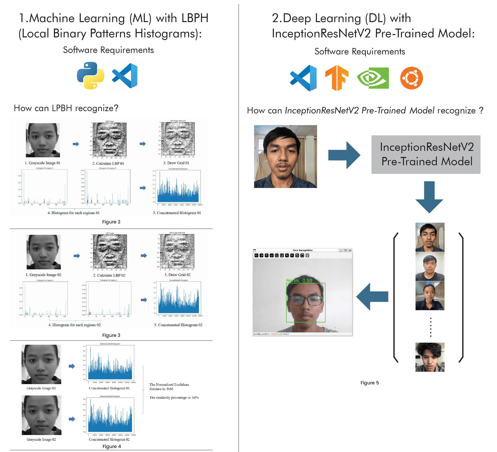
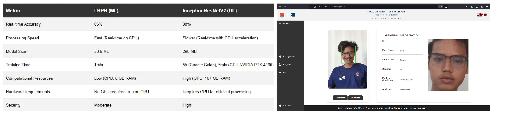

# 🧠 Real-Time Face Recognition for Enhanced Security

This project captures a user’s face and compares it with others using two approaches:

* **Machine Learning** with **Binary Local Pattern Histogram (LBPH)**
* **Deep Learning** with **InceptionResNetV2** pre-trained model

While the LBPH model offers faster performance on lower-end systems, its accuracy is limited. The deep learning model, on the other hand, provides significantly better accuracy and robustness.

---

## 🚀 How to Run This Project

1. **Clone the repository:**

   ```bash
   git clone https://github.com/salarymakage/face_recognition.git
   ```

2. **Set up the environment:**
   You can use a virtual environment (recommended) or install dependencies globally.

   **Option A: Using a virtual environment**

   ```bash
   python -m venv env
   source env/bin/activate  # On Windows use `env\Scripts\activate`
   ```

   **Option B: Without a virtual environment**
   Ensure Python is installed and use `pip` globally.

3. **Install required dependencies:**

   ```bash
   pip install django opencv-contrib-python
   ```

4. **Run database migrations:**

   ```bash
   python manage.py makemigrations
   python manage.py migrate
   ```

5. **Start the development server:**

   ```bash
   python manage.py runserver
   ```

---

## ⚠️ Model Privacy Notice

Due to privacy concerns, the trained model is **not published**, as it contains data from classmates. However, a **demo** is available to showcase the application’s functionality.

---

## 📘 Project Overview

### 1. Introduction

A team led by **Dr. Wang Chao** from Shanghai University demonstrated that **D-Wave’s quantum computers** could break RSA encryption \[1]. This raises concerns about the security of traditional password-based systems and emphasizes the need for **stronger alternatives**.

---

### 2. Problem Statement

Quantum computing threatens traditional encryption methods like RSA. Passwords are no longer reliable for securing sensitive systems, especially in fields like **healthcare** and **banking**, making them vulnerable to data breaches.

---

### 3. Objectives

Our goal is to **enhance system security** by replacing passwords with **real-time facial recognition** technology.

---

## 🔬 4. Methodology

### System Design

#### 1. Data Acquisition

* Total of **280 images** across **9 classes**

  * **Training set:** 196 images
  * **Validation set:** 84 images

#### 2. Pre-processing Techniques

* Resize: 250×250 pixels
* Width shift: ±0.2
* Height shift: ±0.2
* Horizontal flip
* Shear range: ±0.2
* Zoom range: ±0.2

#### 3. Feature Extraction

* **Machine Learning:** LBPH (Local Binary Patterns Histogram)
* **Deep Learning:** InceptionResNetV2 (Pre-trained)

#### 4. Recognition

* ML uses **Euclidean Distance** for similarity comparison
* DL uses **model prediction output**

---

### Experiments

* Dataset of 9 face classes
* Evaluated using both ML and DL models

#### ML: LBPH

* Lower system requirements
* Fast on CPU
* Basic histogram pattern comparison

#### DL: InceptionResNetV2

* Higher accuracy
* Requires GPU for optimal performance
* Pre-trained on large-scale datasets



---

## 📊 5. Results

| Metric             | LBPH (ML)  | InceptionResNetV2 (DL) |
| ------------------ | ---------- | ---------------------- |
| Real-Time Accuracy | 66%        | 98%                    |
| Fast on CPU        | ✅          | ❌                      |
| Slow on CPU        | ❌          | ✅                      |
| Platform           | Local (PC) | Google Colab (GPU)     |



> *(Sample GUI output showing real-time face recognition results.)*

---

## 🧾 6. Conclusion

Real-time facial recognition offers a **more secure** alternative to passwords, especially as **quantum computing** advances. Passwords and RSA encryption alone are no longer sufficient. By adopting facial recognition systems, we can protect sensitive data from unauthorized access and stay ahead of evolving cybersecurity threats.

---

## 📚 7. References

1. Wang, C., et al. (2024, October 14). *Chinese researchers break RSA encryption with a quantum computer*. CSO Online.
2. Parth. (2024, February 23). *Understanding Face Recognition Using LBPH Algorithm*. Analytics Vidhya.
3. Code83youma. (2023, October 12). *The Power of Vision with Inception-ResNet Models: A Journey through Cutting-Edge Techniques*.

---

## 🎬 Demo

[](https://youtu.be/nELK_TXifDY)
